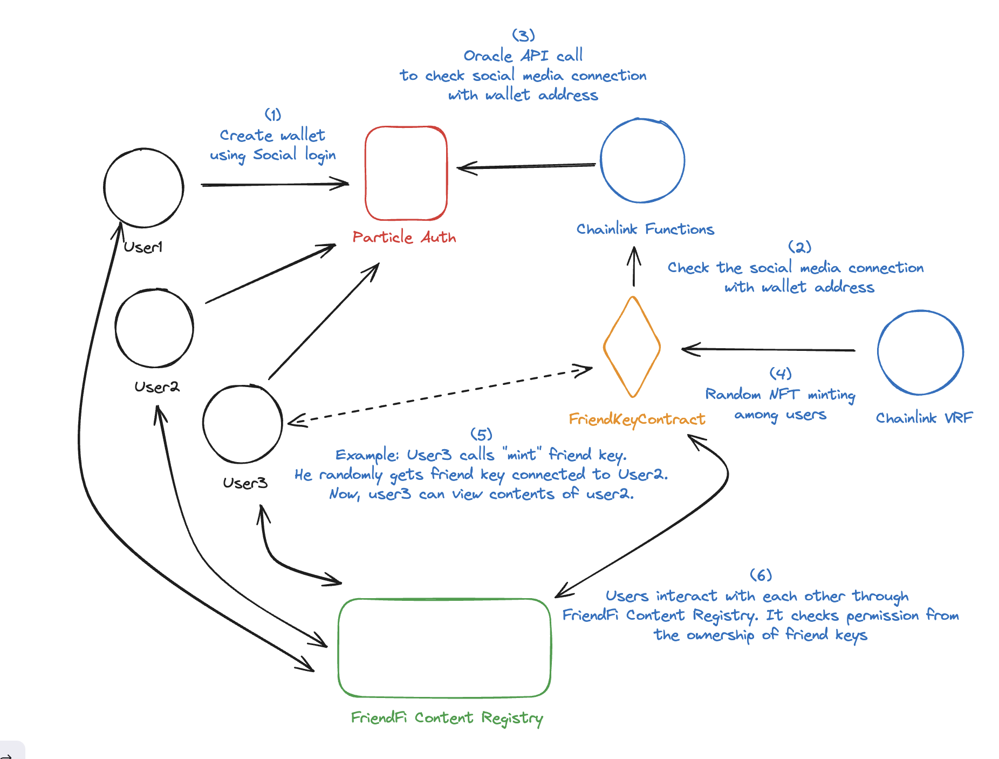

## FriendFi
**FriendFi is a social media with DeFi power. It enables people to reach out each other using financial mechanism relying on smart contract.**


FriendFi is a social media with DeFi power. It enables people to reach out each other using financial mechanism relying on smart contract. Users randomly discover new friends, unlock their exclusive contents, and trade upon those friend connection (in form of tokens). The platform gamifies the global connection and interaction, making social media more exciting.

## System Architecture


FriendFi ecosystem comprises several components as follows:

1. Particle Auth - FriendFi system utilizes Particle Auth, a third party authentication service, to simplify authentication process using the familiarized social logins (e.g., Google, Facebook, X) and generate corresponding wallet address. Particle Auth maps user id and wallet address on their system. This can be used to identify the connection between wallet address and social medias on chain.
2. FriendKeyContract - The core smart contract of the ecosystem. It is used to handle on-chain registration and FriendKey (ERC1155) management (e.g., minting, burning, and merging). A FriendKey determines the connection between users. For example, if Alice holds a FriendKey of BoB, she has a connection to BoB. This connection can be used in many forms of social interaction. This platform uses that connection as a key to access the content of the specific user. A FriendKey can only be generated randomly. This means that users must randomly mint a FriendKey from FriendKeyContract to get access to a user’s content. Alternatively, he can buy it from other users.
3. Chainlink Functions - Since the wallet address and social media connection are stored off chain for privacy preservation, the data must be fetched from off chain to the smart contract. Chainlink Functions is used to make this process secure by relying on decentralized oracle network rather than a single server.
4. Chainlink VRF - The system relies on the verifiable random function (VRF) powered by chainlink decentralized oracle network. This mechanism protects the random function attack. The system provides the fair random function for every type of users.
5. FriendFi Content Registry - This is an example of user interaction upon FriendFi ecosystem, where the access control is governed by FriendKey. While the interaction layer should be decentralized, we make a centralized version for simplicity of this demo. Users can post their content to the content registry. Other users who own a key of the authors can access and interact with their content. The content can be set into 3 friend levels: common, close, best. In order to access higher level of content, users must level up their FriendKey by merging 3 keys in a lower level.

## Usage

### Installation
```shell
$ npm i
```

### Start development server

```shell
$ npm run dev
```

### Build

```shell
$ npm run build
```

### Start production server

```shell
$ npm start
```

### Links
- [Contract Repo](https://github.com/EmbraceXTech/friendfi-contract)